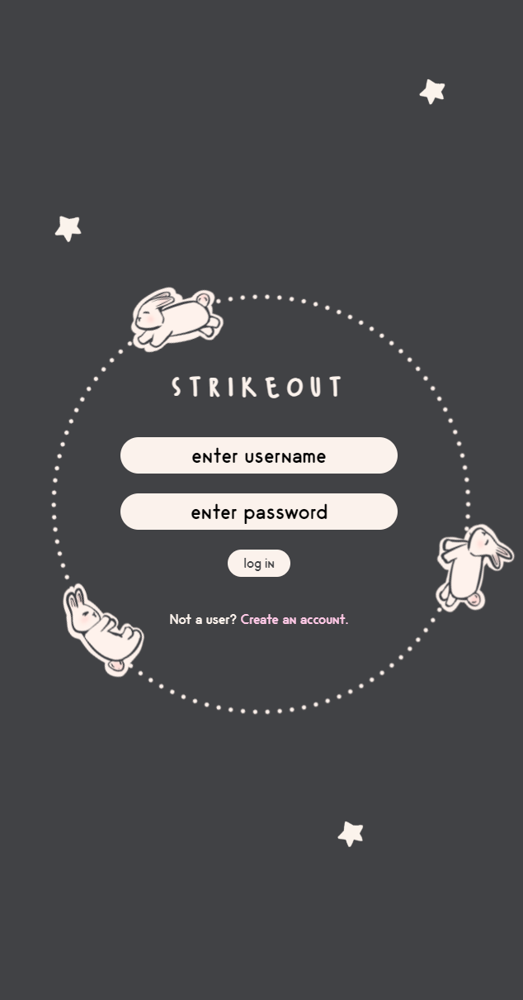
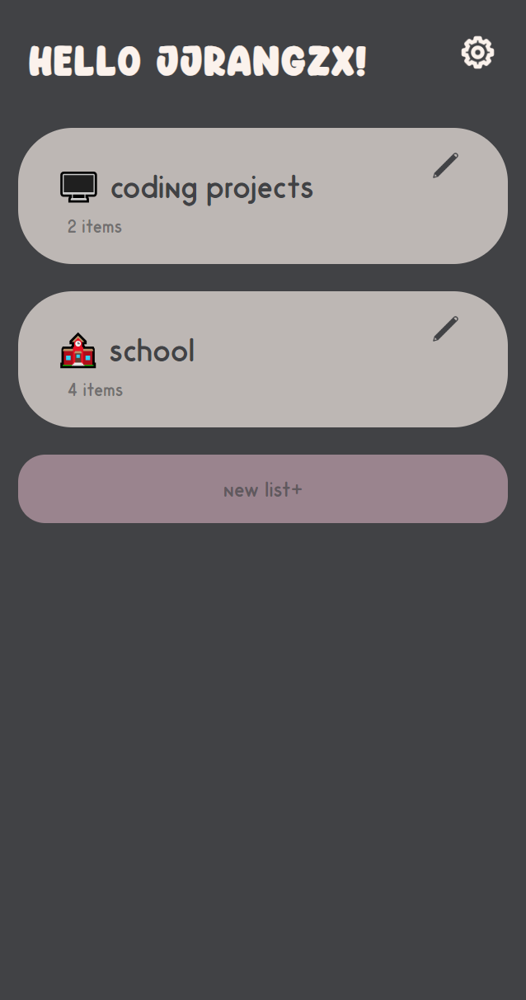
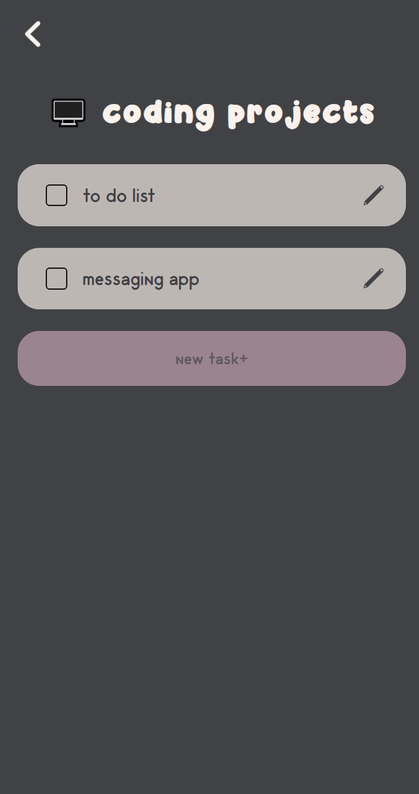

# strikeout

A to do list web app
 

### ☆ ───── Technologies ───── ☆

 
☆ HTML  
☆ CSS  
☆ Javascript  
☆ PHP  
☆ mySQL  
 

### ☆ ───── Features ───── ☆

  
☆ Login and account creation page  
☆ Create, edit delete lists  
☆ Create, edit delete tasks  
  
 
### ☆ ───── Screenshots ───── ☆

  

 

    
    
    

  
 
### ☆ ───── Future enhancements ───── ☆

  
☆ Adding photos to tasks  
☆ UI color options  
